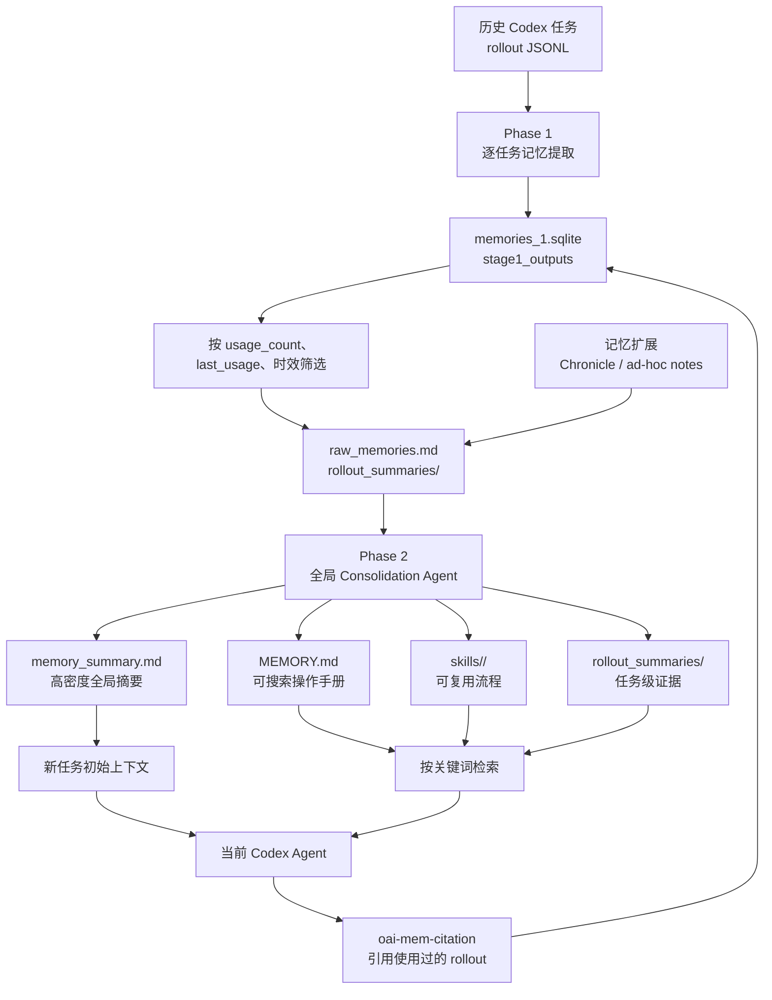

## 结论先说

Codex 的长期记忆不是“模型把所有聊天永久记在参数里”，也不是传统的“向量数据库 + Embedding RAG”。

当前 Codex 的核心实现更像一条后台知识蒸馏流水线：

> 历史任务 JSONL → 模型逐任务提炼 → SQLite 管理候选记忆 → 模型全局整合 → 本地 Markdown 分层存储 → 新任务自动注入摘要、按需检索详情 → 记录哪些记忆真正被使用

它的核心设计是：

- 两阶段异步生成
- 本地 SQLite 协调任务、排序和淘汰
- 本地 Markdown 保存可读记忆
- `memory_summary.md` 被动注入
- `MEMORY.md`、rollout summaries、skills 主动检索
- 引用反馈驱动后续保留
- Git diff 驱动增量更新和遗忘

OpenAI 已经把这套流水线放在 Codex 开源仓库中，官方架构说明见 [Memories Pipeline](https://github.com/openai/codex/blob/main/codex-rs/memories/README.md)。



## 一、Phase 1：把一次任务变成候选记忆

每个根任务启动时，Codex 会在后台检查是否有符合条件的历史 rollout。只有满足以下条件的任务才进入候选集：

- 不是临时会话
- 开启了 memory 功能
- 不是子 Agent 会话
- SQLite 状态库可用
- 来源属于允许的交互式会话
- 没有太新，已经空闲一段时间
- 没超过配置的历史窗口
- 没有被另一个后台 Worker 占用

这意味着它不是在每次回复结束后立刻写记忆，而是在后续根任务启动时，异步处理已经稳定下来的旧任务。[官方 Phase 1 源码](https://github.com/openai/codex/blob/main/codex-rs/memories/write/src/phase1.rs)中可以看到任务 claim、并行执行、失败重试和 rollout 过滤逻辑。

然后，Codex 把过滤后的对话交给一个专门的 Memory Writing Agent，要求严格输出：

```json
{
  "raw_memory": "...",
  "rollout_summary": "...",
  "rollout_slug": "..."
}
```

其中：

- `raw_memory`：详细、结构化的任务记忆
- `rollout_summary`：未来 Agent 可以快速阅读的任务总结
- `rollout_slug`：生成文件名的稳定短标识

Phase 1 的提示词不是“把聊天总结一下”这么简单。它明确要求优先读取：

1. 用户消息：偏好、纠正、验收标准
2. 工具和测试输出：实际证据
3. 助手消息：只作为过程参考

还会给任务标记 `success / partial / uncertain / fail`，并设置了一个非常重要的 No-op Gate：

> 未来 Agent 是否真的会因为这段记忆而表现得更好？

如果答案是否定的，三个字段全部返回空字符串，不创建无意义记忆。完整规则在 [Phase 1 Memory Writing Prompt](https://github.com/openai/codex/blob/main/codex-rs/memories/write/templates/memories/stage_one_system.md)。

生成后还会调用 `redact_secrets()`，将检测到的 Token、Key、密码替换为 `[REDACTED_SECRET]`。不过这仍然是模型和规则驱动的防护，不应当被理解为绝对不会漏掉秘密。

## 二、SQLite：它不是知识库，而是记忆调度器

Phase 1 结果会进入：

[memories_1.sqlite](/Users/itwanger/.codex/memories_1.sqlite)

你当前版本的 `stage1_outputs` 表包含：

```text
thread_id
source_updated_at
raw_memory
rollout_summary
rollout_slug
generated_at
usage_count
last_usage
selected_for_phase2
selected_for_phase2_source_updated_at
```

这里最有意思的是：

- `usage_count`：这条记忆实际被引用过多少次
- `last_usage`：最后一次使用时间
- `selected_for_phase2`：上一次是否进入全局 consolidation
- `source_updated_at`：原任务后来有没有继续变化

所以 Codex 不只是按“新旧”保留记忆，还会根据“过去有没有真正帮到 Agent”进行排序。

官方 Phase 2 规则是：

1. 优先按 `usage_count` 排序
2. 再比较 `last_usage`
3. 从未使用过的新记忆使用 `generated_at`
4. 超过 `max_unused_days` 的长期未使用记忆不再进入 Phase 2
5. 更老的无用 Stage 1 数据可以被清理

这是一个简单但实用的强化反馈环：

> 被实际引用的记忆更容易活下去；从不使用的记忆逐渐退出。

它不是向量相似度打分，而是任务级的使用频率与时效排序。

## 三、Phase 2：把很多任务压缩成分层知识库

Phase 2 会先取得一个全局锁，保证只有一个 consolidation 任务操作记忆目录。

随后它会：

1. 从 SQLite 取出排名靠前的 Stage 1 输出
2. 生成或更新 `raw_memories.md`
3. 同步 `rollout_summaries/`
4. 清理不再入选的旧摘要
5. 对比上一次成功状态，生成 Git 风格 diff
6. 如果确实有变化，启动内部 Consolidation Agent
7. 更新 `MEMORY.md`、`memory_summary.md` 和可选 skills
8. 成功后重置 Git baseline

[Phase 2 源码](https://github.com/openai/codex/blob/main/codex-rs/memories/write/src/phase2.rs)还显示，这个内部 Agent 被锁得很严：

- 不允许审批交互
- 不允许网络
- 不加载 Apps、Plugins
- 不允许继续派生子 Agent
- 不读取自身旧记忆
- 只能写本地 memory root
- 自己是 ephemeral，不会反过来被 Phase 1 记住

这样可以避免“记忆 Agent 又记住自己生成记忆的过程”形成递归污染。

## 四、最终生成的四层记忆

### 1. `memory_summary.md`：被动记忆

你当前的文件是：

[memory_summary.md](/Users/itwanger/.codex/memories/memory_summary.md:1)

它包含：

- `User Profile`
- `User preferences`
- `General Tips`
- `What's in Memory`

它不是项目操作手册，而是高密度用户画像、稳定偏好和检索索引。官方 consolidation 提示明确写着：该文件会进入系统提示，并且必须尽量高密度、可导航。[官方 Consolidation Prompt](https://github.com/openai/codex/blob/main/codex-rs/memories/write/templates/memories/consolidation.md)

需要注意，“始终加载”不等于每个普通 Turn 都重新读取磁盘。更准确的理解是：它属于新会话或重新构建初始上下文时的开发者指令；普通连续 Turn 可以复用已有上下文。

### 2. `MEMORY.md`：主动检索目录

[MEMORY.md](/Users/itwanger/.codex/memories/MEMORY.md:1) 是更详细的长期操作手册，按以下结构组织：

```markdown
# Task Group: 某个项目或任务族
scope: ...
applies_to: cwd=...

## Task 1
### rollout_summary_files
### keywords

## User preferences
## Reusable knowledge
## Failures and how to do differently
```

Agent 不会默认把这 24 万字节左右的文件全部塞进上下文，而是从 `memory_summary.md` 提取关键词，再搜索 `MEMORY.md`。

### 3. `rollout_summaries/`：任务级证据

这里保存每个被选中 rollout 的详细摘要，包含：

- 用户真正要求了什么
- 做了哪些操作
- 哪些结果被验证
- 哪些只是部分完成
- 出现过什么失败
- 下次如何避免
- 对应原始 rollout 路径和 thread ID

只有当 `MEMORY.md` 不够回答当前问题时，Agent 才继续打开一两个相关摘要。

### 4. `skills/`：程序性记忆

如果某套流程重复出现，而且有稳定的触发条件、步骤、检查方式和失败处理，Phase 2 可以把它升级为 Skill：

```text
skills/<skill-name>/
├── SKILL.md
├── scripts/
├── templates/
└── examples/
```

这相当于从“我记得以前做过”升级成“我已经总结出一套可重复执行的 SOP”。

## 五、记忆是怎么被召回的

召回分为被动和主动两条路径。

被动召回：

- 新任务初始上下文包含 `memory_summary.md`
- Agent 一开始就知道大致用户画像、偏好和有哪些记忆主题

主动召回：

1. 从摘要里提取当前任务关键词
2. 搜索 `MEMORY.md`
3. 根据命中结果打开相关 Skill 或 rollout summary
4. 如果事实可能过期，再回到真实仓库、配置或网页验证

当前 Codex 还会识别对 memory 文件的安全读取和搜索命令，分类记录访问的是 `MEMORY.md`、summary、raw memories、rollout summaries 还是 skills，源码见 [read usage telemetry](https://github.com/openai/codex/blob/main/codex-rs/memories/read/src/usage.rs)。

当回答真正使用了历史记忆时，最终回复会携带不可见或折叠的：

```xml

```

解析器会提取 rollout ID，映射回历史 thread。[引用解析源码](https://github.com/openai/codex/blob/main/codex-rs/memories/read/src/citations.rs)结合本机二进制中的更新 SQL，可以确认这会影响 `usage_count` 和 `last_usage`，进而影响下一轮保留排序。

## 六、它和上下文压缩不是一回事

| 机制 | 作用范围 | 解决的问题 | 主要产物 |
|---|---|---|---|
| 当前上下文 | 当前 Turn/线程 | 模型现在正在处理什么 | 消息、工具结果 |
| Compaction | 同一个长线程 | 上下文窗口快满了 | 当前线程压缩摘要 |
| Codex Long-term Memory | 跨任务、跨线程 | 以后如何更懂用户和项目 | SQLite + Markdown |
| ChatGPT Memory | ChatGPT 产品级个性化 | 用户偏好和历史聊天参考 | Saved memories / Chat history |

Compaction 保存的是“这个长任务进行到哪里”；长期记忆保存的是“以后遇到类似任务，默认应该怎么做”。

ChatGPT 官方所说的 Saved Memories 和 Reference Chat History 是另一套产品机制，见 [ChatGPT Memory 说明](https://help.openai.com/en/articles/11146739-how-does-reference-saved-memories-work)。Codex 的聊天历史也与普通 ChatGPT 历史保持区分，[官方帮助中心](https://help.openai.com/en/articles/20001275-chatgpt-work-and-codex)对此有明确说明。

因此，不应该把“ChatGPT 记得我的饮食偏好”和“Codex 记得这个仓库该怎么测试”当作同一个存储系统。

## 七、你当前机器上的真实运行状态

这是我在 2026-07-29 做的只读检查：

| 项目 | 当前状态 |
|---|---|
| Codex CLI | `0.146.0-alpha.3.1` |
| Memory Feature | 已开启 |
| 使用已有记忆 | 已开启 |
| 生成新记忆 | 已开启 |
| 外部上下文污染保护 | 已开启 |
| Stage 1 有效输出 | 46 条 |
| 已进入 Phase 2 | 46 条 |
| 曾被使用的记忆 | 28 条 |
| 单条最高使用次数 | 30 次 |
| rollout summaries | 46 个 |
| memory skills | 5 个 |
| Chronicle resources | 623 个 |
| 最近一次 Phase 2 | 2026-07-29 15:38 成功 |

配置可以直接在 [config.toml](/Users/itwanger/.codex/config.toml:173) 查看，其中关键部分是：

```toml
[features]
memories = true
chronicle = true

[memories]
use_memories = true
disable_on_external_context = true
generate_memories = true
```

当前三个主要文件大约是：

- `memory_summary.md`：360 行，约 40 KB
- `MEMORY.md`：1681 行，约 249 KB
- `raw_memories.md`：3019 行，约 222 KB

说明这套机制在你的机器上不是空壳，而是正在持续生成、整合和使用。

不过运行记录也暴露了一个实际问题：历史上有 77 个 Stage 1 任务失败，其中 67 个是“提取模型上下文空间不足”，另外还有 TLS、超时和 WebSocket 错误。Phase 2 最近仍成功，说明流水线允许部分提取失败，不会因为一条历史任务失败就整体停摆。

## 八、Chronicle 为什么让记忆显得更“全知”

你的环境启用了 Chronicle。它并不是 Codex 核心 rollout 记忆，而是一个 memory extension。

本机 [Chronicle instructions](/Users/itwanger/.codex/memories/extensions/chronicle/instructions.md:1) 写得很清楚：

- 后台被动记录屏幕工作状态
- 每 10 分钟生成 Markdown 摘要
- 摘要还可以结合已启用的 Connector/App 上下文
- Phase 2 必须读取这些资源
- Chronicle 内容可以进入 User Profile、MEMORY 和索引
- 来源会标记为 `[chronicle memory]`

因此你的完整链路实际上是：

```text
Codex 对话历史
        +
后台屏幕工作摘要
        +
显式要求记住/忘记的 ad-hoc notes
        ↓
统一进入 Phase 2 consolidation
```

这解释了为什么 Codex 有时知道你刚在 VS Code、浏览器或其他应用里做了什么——那不只是历史聊天召回，而是 Chronicle 在贡献额外记忆输入。

## 九、这套设计的优势与局限

优势：

- 所有主要记忆都是本地可读 Markdown，可审计
- 不需要把完整历史全部塞进上下文
- 记忆有任务、项目、cwd 和证据来源
- 用户纠正和真实工具结果的权重高于助手自述
- 支持 No-op，避免所有对话都变成永久记忆
- 使用次数能反向影响保留
- Git diff 让增量更新和删除有明确边界
- Phase 2 权限非常受限

局限：

- 它仍然是 LLM 生成的摘要，可能误解、过度概括或错误泛化
- 核心召回偏关键词和文件检索，不是成熟的向量语义检索，换一种说法可能漏召回
- `memory_summary.md` 是全局文件，多仓库内容会竞争有限的提示词空间
- 新记忆不是实时写入，必须等任务空闲和后续启动流水线
- 超长 rollout 可能导致 Phase 1 上下文不足，你本机已经出现了这个问题
- 本地存储不等于完全离线：Phase 1 和 Phase 2 仍要调用模型
- Markdown 和 SQLite 都是本地明文可读资产，需要把本机文件权限当作隐私边界
- Chronicle 的信息面远大于普通 Codex 聊天记忆，隐私影响也更大

OpenAI 仓库曾出现过“全局 `memory_summary.md` 在多项目间产生噪声”的问题讨论；即使具体实现不断变化，这个架构张力仍值得注意：[cwd 过滤问题 #17496](https://github.com/openai/codex/issues/17496)。你的当前摘要中也确实同时存在多个仓库的路由信息。

## 最准确的一句话概括

> Codex 长期记忆是一套由 LLM 负责提炼、由 SQLite 负责调度、由 Markdown 负责保存、由系统提示和关键词检索负责召回、由引用次数负责强化、由 Git diff 和时效规则负责遗忘的本地渐进式知识库。

它“记住”的不是完整对话，而是未来 Agent 可能复用的用户偏好、项目地图、验证方式、失败教训和操作流程。