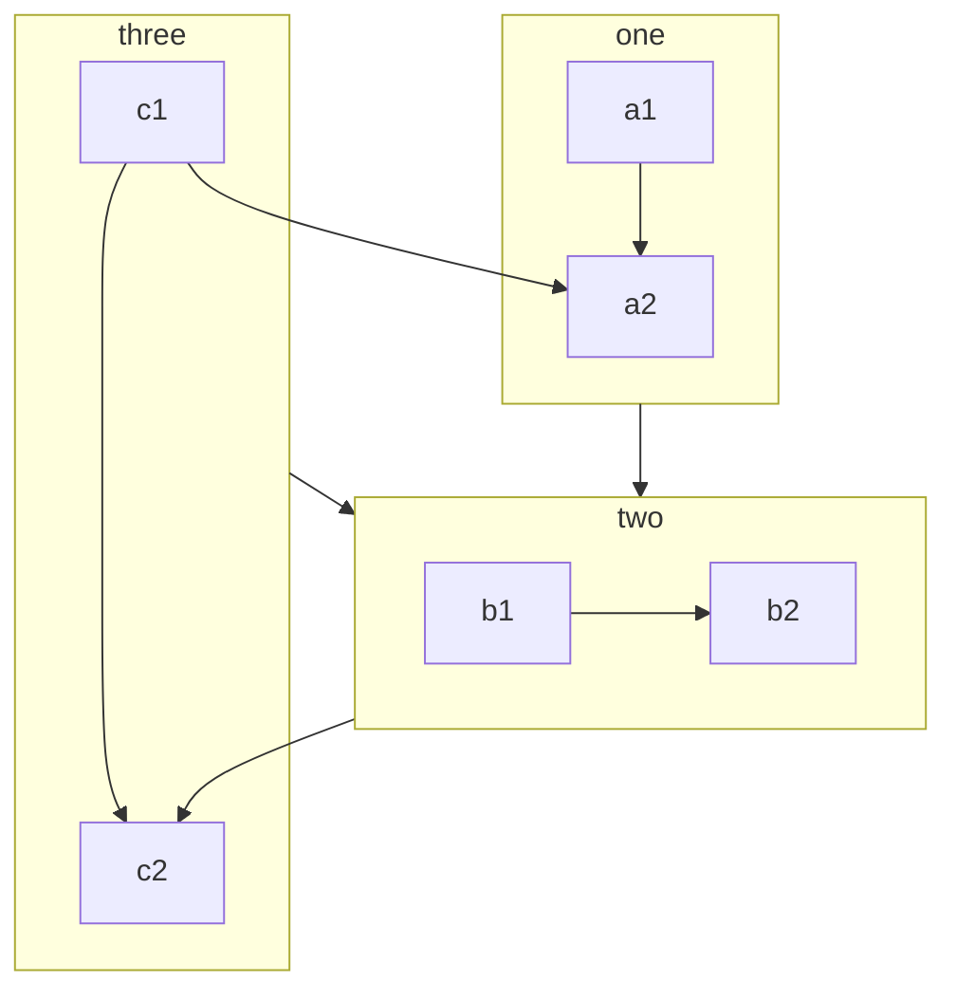

VuePress 的每个文档页面都是由 Markdown 渲染而成。所以你需要通过在相应路径创建编写 Markdown 建立你的文档或博客页面。

<!-- more -->

## Markdown 介绍

如果你是一个新手，还不会编写 Markdown，请先阅读 [Markdown 介绍](https://vuepress-theme-hope.github.io/v2/zh/basic/markdown/README.html) 和 [Markdown 演示](https://vuepress-theme-hope.github.io/v2/zh/basic/markdown/demo.html)。

::: info Frontmatter

Frontmatter 是 VuePress 中很重要的一个概念，如果你不了解它，你需要阅读 [Frontmatter 介绍](https://vuepress-theme-hope.github.io/v2/zh/basic/vuepress/page.html#front-matter)。

:::

## VuePress 扩展

为了丰富文档写作，VuePress 对 Markdown 语法进行了扩展。

关于这些扩展，请阅读 [VuePress 中的 Markdown 扩展](https://vuepress-theme-hope.github.io/v2/zh/basic/vuepress/markdown.html)。

## 主题扩展

### 一键启用

你可以设置 `themeconfig.plugins.htmlEnhance.enableAll` 启用 [md-enhance](https://vuepress-theme-hope.github.io/v2/md-enhance) 插件的所有功能。

```js {3-5}
module.exports = {
  themeConfig: {
    plugins: {
      mdEnhance: {
        enableAll: true,
      },
    },
  },
};
```

### 自定义容器

::: v-pre

安全的在 Markdown 中使用 {{ variable }}。

:::

::: info 自定义标题

信息容器，包含 `代码` 与 [链接](#markdown)。

```js
const a = 1;
```

:::

::: tip 自定义标题

提示容器

:::

::: warning 自定义标题

警告容器

:::

::: danger 自定义标题

危险容器

:::

::: details 自定义标题

详情容器

:::

:::: details 代码

```md
::: v-pre

安全的在 Markdown 中使用 {{ variable }}。

:::

::: info 自定义标题

信息容器

:::

::: tip 自定义标题

提示容器

:::

::: warning 自定义标题

警告容器

:::

::: danger 自定义标题

危险容器

:::

::: details 自定义标题

详情容器

:::
```

::::

- [查看详情](https://vuepress-theme-hope.github.io/v2/zh/guide/markdown/container.html)

### 代码块

:::: code-group

::: code-group-item yarn

```bash
yarn add -D vuepress-theme-hope
```

:::

::: code-group-item npm:active

```bash
npm i -D vuepress-theme-hope
```

:::

::::

- [查看详情](https://vuepress-theme-hope.github.io/v2/zh/guide/markdown/code-group.html)

### 自定义对齐

::: center

我是居中的

:::

::: right

我在右对齐

:::

- [查看详情](https://vuepress-theme-hope.github.io/v2/zh/guide/markdown/align.html)

### 上下角标

19^th^ H~2~O

- [查看详情](https://vuepress-theme-hope.github.io/v2/zh/guide/markdown/sup-sub.html)

### 脚注

此文字有脚注[^first].

[^first]: 这是脚注内容

- [查看详情](https://vuepress-theme-hope.github.io/v2/zh/guide/markdown/footnote.html)

### 标记

你可以标记 ==重要的内容== 。

- [查看详情](https://vuepress-theme-hope.github.io/v2/zh/guide/markdown/mark.html)

### 任务列表

- [x] 计划 1
- [ ] 计划 2

- [查看详情](https://vuepress-theme-hope.github.io/v2/zh/guide/markdown/tasklist.html)

### 图表

::: chart 一个散点图案例

```json
{
  "type": "scatter",
  "data": {
    "datasets": [
      {
        "label": "散点数据集",
        "data": [
          { "x": -10, "y": 0 },
          { "x": 0, "y": 10 },
          { "x": 10, "y": 5 },
          { "x": 0.5, "y": 5.5 }
        ],
        "backgroundColor": "rgb(255, 99, 132)"
      }
    ]
  },
  "options": {
    "scales": {
      "x": {
        "type": "linear",
        "position": "bottom"
      }
    }
  }
}
```

:::

- [查看详情](https://vuepress-theme-hope.github.io/v2/zh/guide/markdown/chart.html)

### 流程图

```flow
cond=>condition: 是否执行操作?
process=>operation: 操作
e=>end: 结束

cond(yes)->process->e
cond(no)->e
```

- [查看详情](https://vuepress-theme-hope.github.io/v2/zh/guide/markdown/flowchart.html)

## Mermaid



- [查看详情](https://vuepress-theme-hope.github.io/v2/zh/guide/markdown/mermaid.html)

### Tex 语法

$$
\frac {\partial^r} {\partial \omega^r} \left(\frac {y^{\omega}} {\omega}\right)
= \left(\frac {y^{\omega}} {\omega}\right) \left\{(\log y)^r + \sum_{i=1}^r \frac {(-1)^i r \cdots (r-i+1) (\log y)^{r-i}} {\omega^i} \right\}
$$

- [查看详情](https://vuepress-theme-hope.github.io/v2/zh/guide/markdown/tex.html)

### 代码演示

::: demo 一个普通 Demo

```html
<h1>VuePress Theme Hope</h1>
<p><span id="very">非常</span>强大!</p>
```

```js
document.querySelector("#very").addEventListener("click", () => {
  alert("非常强大");
});
```

```css
span {
  color: red;
}
```

:::

- [查看详情](https://vuepress-theme-hope.github.io/v2/zh/guide/markdown/demo.html)

### 幻灯片

@slidestart

## 幻灯片 1

一个有文字和 [链接](https://mrhope.site) 的段落

---

## 幻灯片 2

- 项目 1
- 项目 2

---

## 幻灯片 3.1

```js
const a = 1;
```

--

## 幻灯片 3.2

$$
J(\theta_0,\theta_1) = \sum_{i=0}
$$

@slideend

- [查看详情](https://vuepress-theme-hope.github.io/v2/zh/guide/markdown/presentation.html)
