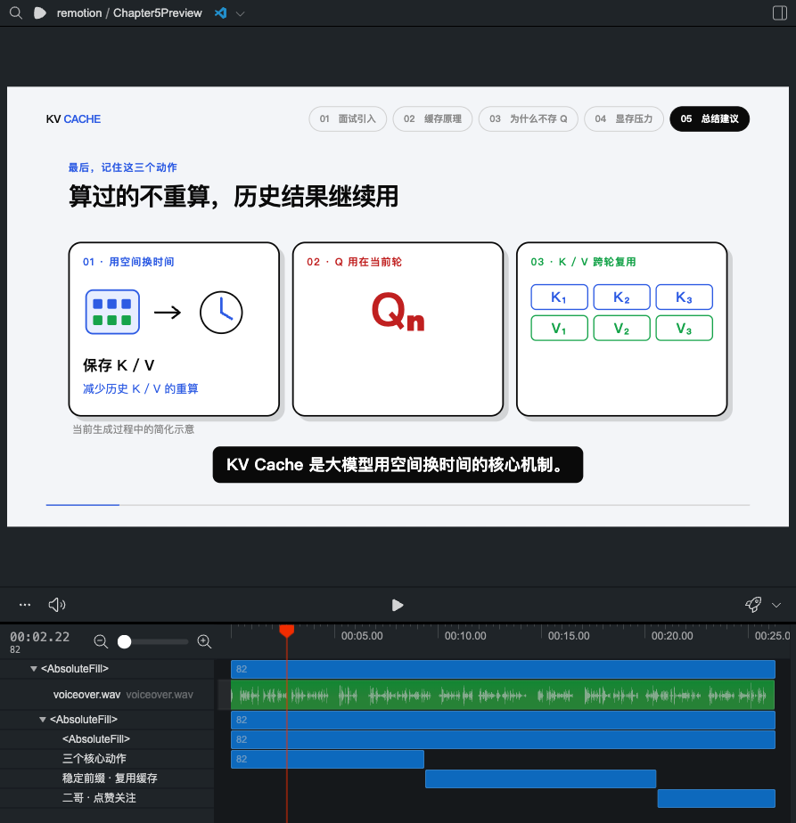
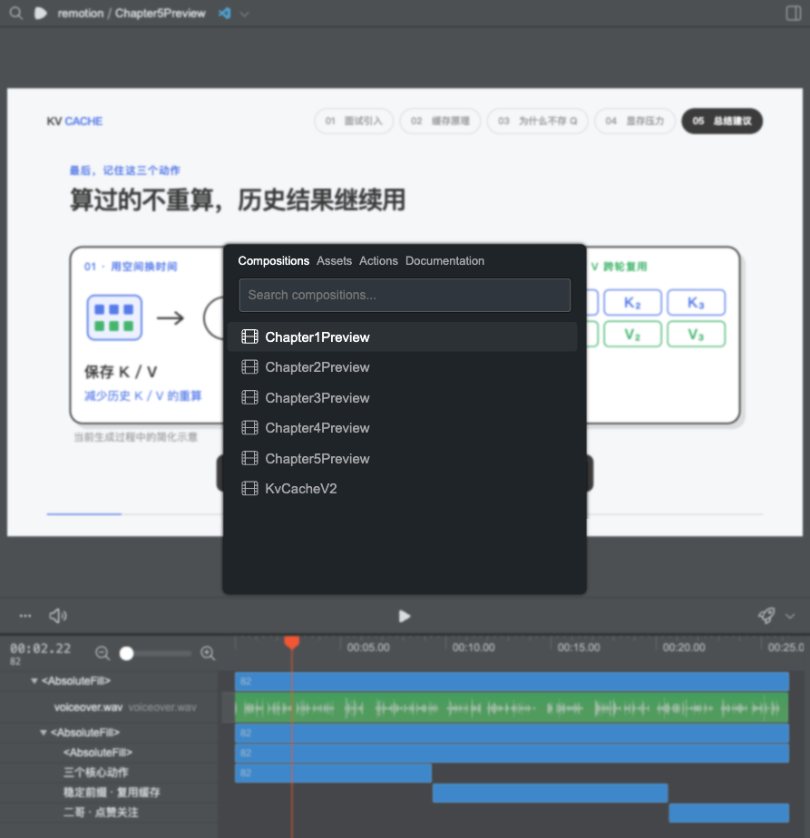
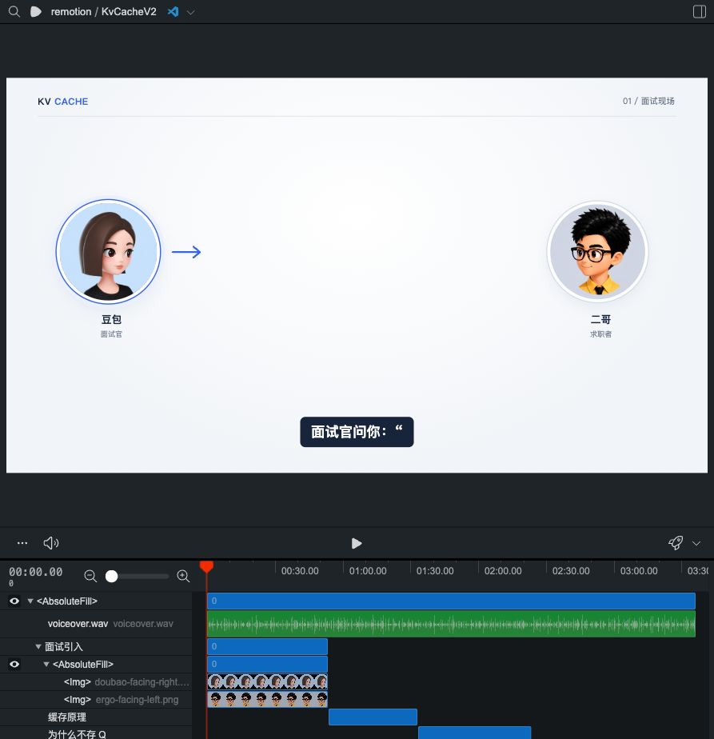
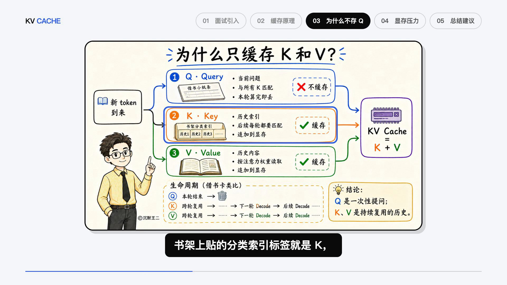
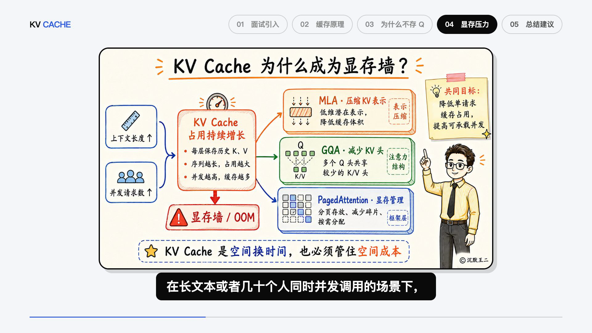
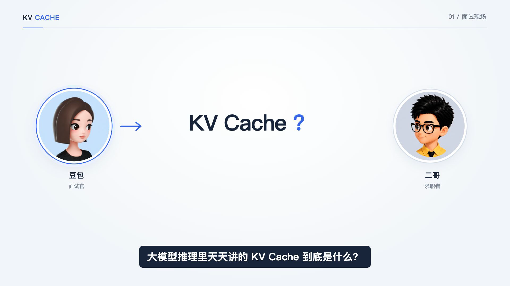
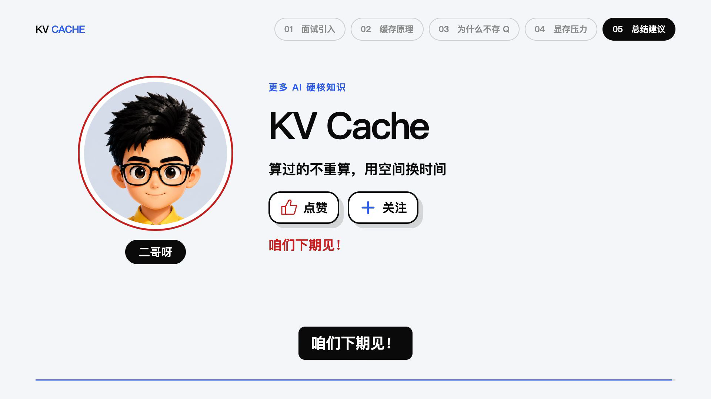

# 二哥视频制作：员工图文操作手册

这份手册教你把一篇已经确认的文章或口播稿，做成带二哥配音、动画和字幕的 MP4。 **日常工作以“给 AI 发指令、听配音、看预览、提出修改”为主，不要求你自己写动画代码。** 首次电脑配置可交给技术同事完成。

适用工作流：本仓库的 `ergo-remotion-video` Skill。主流程以 macOS 为例，截图来自 2026-09-07 实际制作的 KV Cache V2。Windows 员工先请技术同事适配路径、浏览器和软链接，不要直接照抄 macOS 安装命令。

**先记住：稿子确认 → 配音 → 逐章预览 → 回复“继续” → 完整预览 → 回复“出片” → 检查并交付 MP4。** 浏览器里能播放，不代表已经生成成片。



*图 1：实际 Remotion Studio 章节预览。你主要负责看画面、听声音、指出具体问题。*

## 阅读路线

- 第一次上手：先读 [1. 分工与准备](#prepare)，再完成 [2. 首次配置](#setup)、[3. 配音配置](#voice)。
- 电脑已经配好：直接读 [4. 每期制作](#production) 和 [5. 如何验收](#review)。
- 做到一半需要修改：读 [6. 修改与继续](#changes)。
- 交给同事或提交成片：读 [7. 出片与交付](#delivery)。
- 遇到报错：读 [8. 常见问题](#troubleshooting)，把报错原文交给 AI，不要反复从头重做。
- 技术同事：查看 [9. 命令速查](#commands)、[10. 文件归属](#files)。
- 每天开工前：复制 [11. 员工操作卡](#checklist)。

<a id="prepare"></a>

## 1. 分工与准备

### 1.1 谁负责什么

| 角色 | 要做的事 | 完成标志 |
|---|---|---|
| 内容负责人 | 确认源稿、技术内容、音色、视觉基准、领取口令和结尾 | 员工拿到一份可制作的稿子 |
| 制作员工 | 发制作指令、试听配音、逐章验收、检查成片 | MP4 能播放，内容与稿子一致 |
| AI 助手 | 读取 Skill、整理项目、调用工具、写动画、对齐字幕、检查和导出 | 项目文件齐全，检查报告通过 |
| 技术同事 | 首次安装、配置服务权限、排查环境与依赖问题 | AI 所在环境能运行工具并调用配音服务 |

### 1.2 开工前领取这些材料

- 已确认的 Markdown 稿子，以及它在仓库里的文件路径。
- 本期项目名，例如 `what-is-kv-cache-v3`；同一期的新版本用新目录，避免覆盖旧版。
- 使用哪个已授权的音色、是否沿用默认语速、是否有指定人物图片。
- 可以调用该音色的火山语音 API Key，由负责人通过团队约定的安全方式配置。
- 当前代码仓库与 Skills 的版本。 **不能只收到一份 SKILL.md，就认为已经装好视频工具。**

如果使用的是全新音色，需要负责人先完成音色创建或授权。此视频工具调用已有音色，不负责自动训练新音色。

### 1.3 几个词，看懂即可

| 名称 | 用大白话解释 |
|---|---|
| Skill | AI 的工作说明书，规定怎么制作、怎么验收 |
| 仓库根目录 | `toBeBetterJavaer` 这个大文件夹；本文多数命令都从这里运行 |
| 视频项目 | 某一期自己的文件夹，里面放稿子、配音、图片、动画和 MP4 |
| TTS | 把文字读成声音的服务，会使用服务额度 |
| beat | 一段意思完整的口播单元；不等于一句字幕，也不等于一个镜头 |
| 时间轴 / cues | 每段真实配音从何时开始、持续多久；画面按它安排 |
| Composition | 可单独预览或导出的一段视频，可以是一章，也可以是全片 |
| Studio | 浏览器里的视频预览和检查界面 |
| render / 渲染 | 把声音与画面真正计算成 MP4 文件 |
| dry-run | 只检查计划；当前配音工具的 dry-run 不调用 TTS、不写音频 |

### 1.4 本手册使用哪个 Skill

主流程只使用 [ergo-remotion-video](../../../../.agents/skills/ergo-remotion-video/SKILL.md)。可按需要搭配：

| 需求 | 使用方式 |
|---|---|
| 还没有口播稿，或需要优化口播 | 先用 `video-script`，稿子确认后再制作视频 |
| 正文缺少配图，需要新图 | 按仓库要求用 `itwanger-image`；已有正文图先保留使用 |
| 成片后要平台封面 | 另用 `video-cover-image`，封面不是正文动画制作的前置要求 |

不要同时套用 `itwanger-video`、`itwanger-voice` 的另一套目录、配音与导出方式。本手册使用的是本仓库的火山 TTS + `script/shared` 工具，不需要员工额外安装本地声音训练模型。

<a id="setup"></a>

## 2. 首次配置电脑：只做一次

### 2.1 最省心的办法：让技术同事或 AI 先检查

在公司指定的 AI 编程助手中打开整个 `toBeBetterJavaer` 文件夹，然后发送：

```text
我要使用这个仓库的 ergo-remotion-video Skill 制作视频。
请先读取当前 Skill 和 docs/src/ai/script/shared/WORKFLOW.md，检查：
1. 当前工作目录是否是正确的仓库；Skill 路径是否可读。
2. node、npm、python3、ffmpeg、ffprobe 和浏览器是否可用。
3. docs/src/ai/script 的共用依赖是否能解析。
4. 默认配置、头像、面试素材是否齐全。
5. 配音环境变量是否存在，只报告已设置或未设置，不显示内容。
先列出缺少的项目和对应修复方法，不合成配音、不渲染视频，
不删除旧环境，不改其他视频，不提交代码。
```

“最新 Skills”指负责人指定的当前仓库版本。AI 应重新读取文件，而不是套用上一次聊天的记忆。 **不要为了更新 Skill 顺手把 Remotion 升级到最新版。** 本仓库的依赖版本已经锁定。

### 2.2 必要软件

| 软件 / 条件 | 用途 | 本次制作机器的实测情况 |
|---|---|---|
| 公司指定的 AI 编程助手 | 读写文件、运行命令、制作动画 | 在仓库目录中工作，有文件与终端能力 |
| Git 或团队提供的完整仓库 | 获取代码、Skill、共享工具和素材 | Git 仓库 |
| Node.js 与 npm | 运行 Remotion | Node.js 22.22.0；新电脑可按团队基准安装 22 系列 |
| Python 3 | 配音、时间轴、检查脚本 | Python 3.9.6 可运行现有共享脚本 |
| FFmpeg、FFprobe | 音频处理、封装、检查 | FFmpeg 8.0.1；`ffprobe` 随 FFmpeg 安装 |
| Google Chrome | 预览与渲染画面 | 共享入口会自动识别 macOS 常规安装路径 |
| 中文字体 | 避免乱码及排版偏差 | macOS 使用系统中文字体；换电脑后仍需看关键帧 |

这些版本是已跑通的记录，不代表必须完全一致，也不是无限期兼容承诺。共享 Python 工具主要使用标准库， **正常主流程不需要员工执行 `pip install mlx-audio`** 。本次制作的局部 ASR 检查属于已有机器上的辅助能力；没有该能力时，先试听并做音频能量检查，不能声称已完成 ASR 检查。

### 2.3 macOS 安装示例：由技术同事操作

先打开“终端”（可用系统搜索输入“终端”），逐行执行：

```bash
node --version
npm --version
python3 --version
ffmpeg -version
ffprobe -version
git --version
```

出现版本号说明能找到软件。出现 `command not found` 说明该软件未安装，或终端还找不到它。不要把一屏版本信息当成报错。

如果没有 Homebrew，按 [Homebrew 官方安装页](https://brew.sh/) 完成安装，并执行安装器最后给出的 `Next steps`。如果提示需要命令行开发工具，按系统提示安装后再继续。

在已安装 Homebrew、且电脑没有团队既定 Node 环境时，可用：

```bash
brew install node@22 python ffmpeg
export PATH="$(brew --prefix node@22)/bin:$PATH"
node --version
npm --version
```

此 `export PATH` 只影响当前终端。需要长期生效时，请技术同事把对应设置加入你的 shell 配置，或使用团队既有 Node 版本管理方案。已有 NVM 等环境时优先沿用，不要同时叠加安装来掩盖问题。安装命令依据 [Node 22 Homebrew 条目](https://formulae.brew.sh/formula/node@22) 与 [FFmpeg Homebrew 条目](https://formulae.brew.sh/formula/ffmpeg.html)。

Chrome 可通过 [Google Chrome 官网](https://www.google.com/chrome/) 安装到“应用程序”。本工具自动识别的 macOS 路径是 `/Applications/Google Chrome.app/Contents/MacOS/Google Chrome`；其他位置可由技术同事配置 `REMOTION_BROWSER_EXECUTABLE`。第一次安装之后，再让 AI 运行一次环境检查。

### 2.4 获取完整仓库

优先领取团队已准备好的项目。如果需要自行克隆，可以从团队指定位置获取；当前仓库地址示例为：

```bash
git clone https://github.com/itwanger/toBeBetterJavaer.git
cd toBeBetterJavaer
```

已经有仓库时不要再克隆一份。让技术同事检查当前修改，再同步负责人指定版本；不要无脑执行重置或覆盖。

在 AI 应用里打开这个根目录，而不是只打开稿子文件。下面这些路径应存在：

```text
toBeBetterJavaer/
├── .agents/skills/ergo-remotion-video/SKILL.md
├── .claude/skills/ergo-remotion-video/SKILL.md
└── docs/src/ai/script/
    ├── README.md
    ├── package.json
    ├── package-lock.json
    └── shared/
```

当前 `.agents/skills/ergo-remotion-video` 是指向 `.claude/skills/ergo-remotion-video` 的软链接，两者是同一套规则。压缩包转移时如果软链接损坏，请技术同事修复；不要另建两份不同内容的 Skill。

如果 AI 没识别 Skill，发送：

```text
请直接读取 .agents/skills/ergo-remotion-video/SKILL.md，
如果这个软链接不可用，检查 .claude/skills/ergo-remotion-video/SKILL.md。
按文件里的当前规则执行。请先确认实际读取的路径。
```

### 2.5 安装共用 Node 依赖

**全新克隆、`docs/src/ai/script/node_modules` 尚不存在时** ，在仓库根目录执行：

```bash
npm ci --prefix docs/src/ai/script
```

等待命令结束后，再检查：

```bash
node -e "console.log(require.resolve('@remotion/cli/package.json', {paths: ['./docs/src/ai/script']}))"
```

打印出一个真实文件路径就说明能找到 Remotion。依赖按 `package-lock.json` 安装；当前 Remotion 锁定为 `4.0.521`，不要拼成 `remotio`，不要在每期项目下各装一套。

**已有制作电脑的特殊情况：** 本次机器的 `script/node_modules` 复用仓库已有的 `remotion-project/node_modules` 软链接。不要直接对这个共享安装反复执行 `npm ci`，它可能清理目标目录中的依赖。请先检查链接是否有效，能解析就复用；失效时交给技术同事处理。

### 2.6 配好后，员工应拿到什么

- AI 能读到本仓库的 Skill，并能运行工具。
- 一份已授权的默认音色配置。
- 配音 Key 在实际运行配音的进程中可用。
- 中文画面能显示、Studio 能打开。
- 同事知道自己的仓库放在哪里，知道最终视频在项目的 `output/`。

<a id="voice"></a>

## 3. 配音与项目配置

### 3.1 API Key、音色 ID、资源 ID 不是一回事

| 项目 | 作用 | 员工怎么获取 |
|---|---|---|
| 语音服务 API Key | 调用火山语音服务的凭证 | 负责人配置；不要粘贴到聊天、截图或 README |
| `speakerId` | 决定用哪个声音读稿 | 负责人提供已授权的音色 ID |
| `resourceId` | 决定使用哪个语音服务资源 | 必须与已开通服务和音色能力相匹配 |
| `apiBase` | 语音请求发送到哪里 | 沿用项目配置，不自行换成聊天 API 地址 |

管理员初次开通时，可参考火山官方 [声音复刻操作文档](https://www.volcengine.com/docs/6561/1167802?lang=zh)：确认服务开通，取得可调用的音色，并在 API Key 管理中配置凭证。控制台位置可能变化，以官方页面为准。 **这里需要的是语音服务凭证，不要默认把聊天模型、Coding Plan 或其他产品的 Key 拿来替换。**

本工具不会替你开通服务、购买额度或创建声音。当前使用 `X-Api-Key` 认证；如果管理员给的是另一套 App ID / Access Token 接口参数，应先让技术同事核对适配方式，不能随便塞进同一个字段。

### 3.2 当前默认配置：看懂，不必全改

新项目默认文件是 [shared/config/video.config.json](shared/config/video.config.json)。下面是本手册编写时的快照，实际制作时让 AI 重新读取：

```json
{
  "tts": {
    "speakerId": "S_j97bqlje2",
    "resourceId": "seed-icl-2.0",
    "apiBase": "https://openspeech.bytedance.com/api/v3/tts/unidirectional/sse",
    "speedRatio": 1.0,
    "audio": {"format": "mp3", "sampleRate": 24000},
    "atempo": 1.10
  },
  "volc": {"apiKeyEnv": "VOLC_TTS_API_KEY"},
  "video": {"width": 1920, "height": 1080, "fps": 30}
}
```

| 字段 | 含义 | 修改时注意 |
|---|---|---|
| `speakerId` | 本期配音是谁 | 上面是当前团队默认值，不保证其他账号可调用 |
| `resourceId` | 当前默认是声音复刻 2.0 资源 | 不要只换声音、忘记检查资源权限 |
| `speedRatio` | 发给 TTS 的语速参数 | 当前默认原速合成；不能只靠它判断最终语速 |
| `atempo` | 合成后处理的语速倍率 | `1.10` 表示约 1.1 倍速；变速可能影响自然度 |
| `sampleRate` | 音频采样率 | 不清楚就保持默认 |
| `width / height` | 视频尺寸 | 当前是横屏 1920×1080；改竖屏需要重新设计版式 |
| `fps` | 每秒多少帧 | 当前 30；不要制作到一半单独修改 |
| `apiKeyEnv` | 程序从哪个环境变量读取 Key | 这里填变量名，不填真实 Key |

初始化会把这些默认值复制到本期 `project.json` 的 `config` 中。 **之后以本期 `project.json` 为准。** 改共享默认值不会自动改变已有视频；只改这期的语速，就只修改这期配置。

### 3.3 安全设置 Key：当前终端方式

下面命令适用于  **macOS 默认 zsh 终端** 。输入第一行后粘贴 Key、按回车；屏幕不回显是正常的。

```zsh
read -rs "VOLC_TTS_API_KEY?请粘贴语音 API Key 后按回车："
export VOLC_TTS_API_KEY
printf '\n'
python3 -c 'import os; print("已设置" if os.environ.get("VOLC_TTS_API_KEY", "").strip() else "未设置")'
```

最后只应显示“已设置”，不要使用 `echo $VOLC_TTS_API_KEY` 展示 Key。当前共享工具只读取进程的环境变量， **不会自动加载 `.env` 文件** 。

关键区别：这个变量只传给当前终端及其后续启动的程序。另一窗口、已经打开的 Codex/Claude 应用，不一定能看到它。

有两种做法，选一种：

1. 技术同事把 Key 配到公司 AI 助手实际执行命令的环境，并让 AI 只检查“已设置 / 未设置”。
2. 员工在上述同一个终端里手动运行配音命令，完成后告诉 AI“配音已生成，请检查并继续”。AI 不需要知道 Key 的值。

不要用 `sudo` 运行配音脚本来解决找不到变量；那可能换到另一个环境。终端关闭后需要重新设置，长期配置由技术同事按团队的凭证管理方式完成。

### 3.4 先试听，再批量

第一次使用新机器或新音色时，让 AI 在 **稿子已确认后** 只合成一个实际 beat。确认能够调用、声音正确、语速自然，再生成剩余配音。实际合成会使用服务额度；只做 `dry-run` 无法证明 Key 和音色权限可用。

```text
稿子已确认。先使用本期 project.json 的音色和语速，
选一段包含中文与英文术语的真实 beat 做配音试听。
只合成该段，把试听文件给我，并报告使用的音色和倍率，不显示 Key。
试听通过前不要批量合成。
```

如果已经沿用负责人确认过的音色与环境，可直接进入正常配音流程，不必每期重新训练或选音色。

<a id="production"></a>

## 4. 每期制作：按这六步走

下面用“新做 KV Cache 第三版”举例，项目名为 `what-is-kv-cache-v3`。 **这是教程示例，员工要把源稿路径和项目名换成本期的。** `v2` 是已完成的示例成片，不应拿它作为新项目输出目录。

### 第一步：给 AI 发开工指令

```text
按照仓库当前最新的 ergo-remotion-video Skill，
把 docs/src/ai/video/what-is-kv-cache.md 制作成一个新版本。
新项目目录用 docs/src/ai/script/what-is-kv-cache-v3。

先读取 Skill、shared/WORKFLOW.md 和当前共享默认配置。
先整理项目文章、口播稿、beats 和分镜，告诉我有哪些章节，
以及每张保留的正文配图放在哪些场景。
按 Skill 处理公众号推广尾段，保留正文资料领取和视频点赞关注结尾。
不改源文章，不覆盖旧视频。
这一阶段先给我确认稿子与配置，不调用 TTS。
```

你应该收到：本期目录、口播稿、章节规划、配图安排、音色与倍率。初始化只生成骨架，不会自动把文章变成完整动画。

检查这些内容：题目对不对、正文是否漏段、技术内容是否已经负责人确认、领取资料的数字有没有改、四处散落的图片是否真正安排到画面里。

**当前默认尾段处理：** 从文末公众号推广段起点删到文件末尾，该段后面的图片一起删除；只清理项目用稿，不改源文章。KV Cache 的明确起点是“这个公众号历史发布过很多有趣的 Agent 知识点”。正文里的 `288 道`、`来个222` 和视频点赞关注结尾继续保留。其他文章让 AI 根据实际稿子定位，不能机械套用不存在的句子。

### 第二步：确认稿子和配音

如果要先试听，使用上一节的试听指令。试听满意后发送：

```text
稿子、音色和语速已确认，开始生成本期全部配音。
222 的口令读“二二二”，288 道读“二百八十八道”，字幕保留数字。
按完整意思拆 beat，不为凑段数把一句话拆碎。
全部配音完成后，按真实解码采样生成时间轴，并做检查。
然后制作第一章，给我带声音的 Studio 预览和关键帧检查结果。
```

配音阶段可能需要等待。生成的实际时长不必刚好 3 分钟；本次 KV Cache V2 实际成片为 216.6 秒。不要为了凑时长让 AI 删内容或盲目加速。

### 第三步：看第一章

AI 会给你类似 `http://localhost:3003/Chapter1Preview` 的地址。点击打开，播放并听完这一章。你的端口不一定是 `3003`，以 AI 实际启动的地址为准。

如果你看到 `DraftPreview`，它只是草稿模板，不是已经制作好的第一章；让 AI 继续实现本期动画。


*图 2：顶部显示当前 Composition；中间是画面；下方三角按钮播放；左下角是当前位置；底部绿色区域是音轨，蓝色区域是连续场景。截图中的 00:02.22 是时间码，不要直接当成 2.22 秒的小数。反馈时原样抄给 AI 即可。*

操作说明：

1. 点下方三角形播放，听完一遍；有问题时暂停。
2. 点小喇叭检查是否静音；同时确认电脑音量。
3. 点击或拖动底部时间轴回看问题位置。
4. 想看别章，点左上角放大镜，打开 Quick Switcher；Mac 也可用 `⌘K`。
5. 只做预览时不要点右下角的渲染按钮；本流程最终出片统一交给 AI 使用共享命令完成。



*图 3：`Chapter1Preview` 到 `Chapter5Preview` 是单章；`KvCacheV2` 是这次示例的完整视频。新项目名称和章节数量可能不同。*

### 第四步：通过就回复“继续”，有问题就具体指出

通过时：

```text
第一章通过，继续下一章。
```

有问题时：

```text
先修改第一章，不进入下一章。
在 Chapter1Preview 的 00:18 附近，字幕出现太晚，术语已经念完。
请根据本期真实配音调整字幕和对应元素的入场，保留原稿与其他场景。
改完重新给我这一段预览和关键帧。
```

“继续”表示当前章通过，可以做下一章； **不等于授权导出整片** 。逐章验收比整片做完再重改容易定位问题。AI 如果已经收到明确通过，不需要反复问你是否同意继续。

### 第五步：看完整预览

所有章节做完后，让 AI 接好全片并给完整地址。检查章节切换时有没有黑屏、重音、突然截断、字幕错位，尤其是第一句话、章节交界和最后一句。



*图 4：完整示例 `KvCacheV2`，包含五章和一条连续配音。它仍是 Studio 预览；MP4 需要下一步生成。*

你可以发送：

```text
各章已通过，请给我完整预览。
检查全片章节连续、音轨不重复、四张正文配图都实际出现、
字幕与配音一致，并报告实际总时长。先不导出 MP4。
```

### 第六步：确认后回复“出片”

```text
完整预览通过，出片。
按共享入口导出本项目的 MP4，并检查完整解码、尺寸、帧率、帧数、
音画同步和最终成片关键帧。交付 output 里的文件及检查结果。
```

等 AI 给出实际 MP4 文件。不要把 Studio 地址当作成片发给同事；同事的 `localhost` 指向他们自己的电脑，打不开你电脑上的预览。

<a id="review"></a>

## 5. 如何验收：小白也能判断的标准

### 5.1 配音：重点用耳朵听

- 文字完整，没有漏句、多句或擅自加口头禅。
- 音色是负责人指定的声音；整期保持一致。
- 语速自然，不是一味越快越好；一句话中间没有不合理的断开。
- 英文术语、名字、数字读法正确，尤其是 `222` 和 `288`。
- 听到某个术语时，对应画面已经出现或正在快速入场。

语音识别可能把英文或同音字识别错。看到 ASR 报告里有错字，先听真实音频，再决定是否需要重配。能量检测只提供可能的停顿位置，不证明每个词都对齐。

### 5.2 字幕：一次一行，长句分次出现

不要一屏堆两三行长字幕；也不要每拆一句字幕，整张图就重新飞进来。字幕必须与口播对应，不能为了排版擅自改变原意。

反馈格式建议用： **第几章 + 时间位置 + 具体问题 + 希望效果** 。例如：“第三章 00:22，K 的高亮还没出现声音就读过去了；希望在读 K 时已看到对应区域。”

### 5.3 正文画面：看关系，不只看好不好看

正文基准是冷白背景、白底黑边圆角卡片、完整章节导航、单行字幕和细进度条。画面应能解释对象之间的关系和动作，不能所有页面都只剩几个大字方块。



*图 5：原稿配图完整保留，文字没有被裁切，讲到 K 时标出对应区域。配图“已经下载”不等于“已经用进视频”。*



*图 6：给图留够面积，同时给顶部导航、底部字幕留位置。信息图不要被头像、标题或字幕挡住。*

### 5.4 面试开头：只在稿子有面试情节时用



*图 7：豆包与二哥头像相向，中央呈现主题。普通科普稿不用硬加面试剧情；面试结束后恢复正文风格。*

### 5.5 收尾：有内容、有告别、不突然截掉



*图 8：结论、头像、点赞关注与告别按口播出现，最后一句完整保留。*

### 5.6 一章通过前的检查卡

- [ ] 完整听完这一章，稿子和声音都正确。
- [ ] 字幕清晰、没有超出画面或互相重叠。
- [ ] 术语与画面时点对应，同一连续画面不会反复进场。
- [ ] 该章应出现的原稿图片已经实际出现，图片文字可读。
- [ ] 技术示意能看懂，容量或比例的示意没有被当成实测数据。
- [ ] AI 已完成类型检查与关键帧抽查；员工仍做了实际试听。

<a id="changes"></a>

## 6. 修改、续做与版本管理

### 6.1 换句话说，应该重做哪些东西

| 修改类型 | 正常处理范围 |
|---|---|
| 只改颜色、位置、字号 | 改本期动画，重新看关键帧和预览；不重做配音 |
| 字幕太长 | 按真实音频分句显示；保留原文，不必重配声音 |
| 某词读错，文字没错 | 经负责人确认后改该 beat 的 `ttsText`，重做受影响配音，再生成时间轴 |
| 口播文字改了 | 同步 `script.md`、`beats.json`，重做变动配音、时间轴及受影响动画 |
| 改整期语速 | 改本期 `atempo`，重做 processed 音频、时间轴并复检全部章节时点 |
| 改音色 | 相关配音重新合成；不能继续沿用旧音轨 |
| 完整翻新已完成视频 | 建新版本目录，保留旧版；说明哪些风格继续沿用 |
| 导出后又改画面或声音 | 重新验收并重新出片；旧 MP4 不会自动更新 |

`text` 是字幕原文，`ttsText` 仅用于明确的读法调整。不能把改写台词偷偷放在 `ttsText` 中。

### 6.2 继续同一项目

换了一次聊天、第二天继续制作，直接给 AI 项目目录，不必从头初始化：

```text
继续 docs/src/ai/script/what-is-kv-cache-v3。
先读本期 project.json、script.md、beats.json、OUTLINE.md 和 REVIEW.md；
如果有 preview 下的检查记录，一并核对。
确认已经完成和已经验收的部分，再接着做未完成章节。
不重配已验证可复用的声音，不覆盖旧版成片，不另建重复项目。
```

如果 AI 报 `Will not overwrite existing project`，往往是你已经建过项目；应改为“继续已有项目”，而不是删除目录重来。

### 6.3 语速或字幕问题要给位置

```text
只处理第三章这两个问题：
1. 00:12 附近，“Query”读得不自然，请给该段试听修改。
2. 00:25 附近，字幕换得太早，请按实际配音调整。
其余已通过内容沿用。声音若有变动，要重建时间轴并检查后续章起点。
```

### 6.4 素材要求

正文图放在本期 `assets/images/`；参考材料放 `assets/references/`。默认头像由初始化复制。面试头像由 AI 按 Skill 从共享素材复制并记录来源。不能把人物文件放在某个人的下载目录里，再让动画长期依赖那个绝对路径。

<a id="delivery"></a>

## 7. 出片、交付与交接

### 7.1 渲染时会发生什么

AI 使用共享 `remotion.mjs render` 导出，先生成中间视频，再用本期原配音重新封装最终音轨，最后写入 `output/`。渲染期间会看到 `Rendered 1234/6498` 一类进度，这是正常输出；时间估计会变化。

本次 216.6 秒样片的渲染花了数分钟，具体速度取决于电脑与场景。保持电脑唤醒，不要在同一项目边渲染边改动画。失败时保留日志，让 AI 从错误原因处理，不先删除已完成配音。

不要将 `preview/render/remotion-raw.mp4` 作为交付文件。它是中间产物，最终文件以 `output/` 中的 MP4 为准。

### 7.2 什么叫真正完成

必须同时具备：

- `output/` 中存在本次新导出的 MP4。
- 最终文件的尺寸、帧率、总帧数、时长与项目一致。
- 完整解码没有错误。
- 导出声音与原始配音的同步检查通过。
- 从最终 MP4 抽出的关键帧检查通过。
- 员工打开 MP4 播放，至少复听开头、章节交界与结尾；正式交付前完整看一遍。

验证报告通常在 `preview/export-check/report.json`。 **doctor 显示 `ready` 不等于成片已完成** ，类型检查通过也不代表画面一定美观或声音自然。

本次 KV Cache V2 的真实导出记录：

| 项目 | 结果 |
|---|---|
| 文件 | `what-is-kv-cache-v2/output/kv-cache-v2.mp4` |
| 时长 | 216.6 秒，约 3 分 37 秒 |
| 画面 | 1920×1080、30fps、6498 帧 |
| 编码 | H.264 + AAC |
| 大小 | 13,304,369 字节，约 13.3 MB |
| 检查 | 完整解码通过；6 个发声窗口同步检查通过；11 张成片关键帧检查通过 |

这是案例结果，不是每期必须达到的帧数、大小或制作耗时。

### 7.3 发给负责人什么

通常交付： **本次 MP4 + 简短说明** 。例如：

```text
KV Cache 第三版已完成。
成片：kv-cache-v3.mp4
时长：以本期最终报告为准；规格：1080p / 30fps。
稿子与各章已确认，完整解码、音画同步和成片关键帧检查通过。
如需继续编辑，可提供完整项目包。
```

只写已经完成的检查。生成视频不等于已经发布到视频号、B 站或其他平台，发布由负责人另行安排。

### 7.4 同事接着编辑，需要多交一份项目

本仓库默认不把每期视频目录纳入 Git；音频、图片、预览和 MP4 通常留在本地。 **同事拉取代码后，不一定能看到你的这一期项目。**

交接时提供：

1. 整个本期目录：稿子、`project.json`、`beats.json`、分镜、`assets`、`audio`、`build`、`remotion/src`、检查记录与 `output`。
2. 使用的共享工具与 Skill 的仓库版本，让技术同事记录当前 commit。
3. 已通过哪些章、最后改了什么、还有哪些待办。
4. 新机器单独配置的配音权限；Key 不放进项目包。

如果只传 `remotion/src`，同事会缺声音、图片和时间轴。跨电脑解压后，检查 `remotion/public/audio`、`remotion/public/images` 的软链接，必要时由 AI 按共享工具修复。不要直接拷贝原机器的 `node_modules` 作为通用安装包。

<a id="troubleshooting"></a>

## 8. 常见问题：先看这里

| 现象 | 常见原因 | 怎么处理 |
|---|---|---|
| AI 说找不到 Skill | 没打开完整仓库，或软链接失效 | 提供准确 Skill 路径，让 AI 检查 `.agents` 与 `.claude`，不要另造一份规则 |
| `node` / `python3` / `ffmpeg` 找不到 | 未安装或 PATH 不正确 | 让技术同事按环境检查修复；不要盲目重装全部软件 |
| `Cannot find module` / `@remotion/cli` 不存在 | 共用依赖没安装、安装失败或软链接断了 | 检查 `script/node_modules`；新克隆按锁文件安装 |
| `Missing environment variable` | 配音进程看不到 Key | 在实际执行环境检查“已设置 / 未设置”；另一个终端设置不一定有效 |
| 已设置 Key 但 401 / 403 / 无权限 | Key、服务资源、音色或账号权限不匹配 | 把错误码交给管理员核对；不要发送 Key 内容 |
| 服务报配额、余额或资源错误 | 服务侧需要管理员处理 | 先停下批量重试，交管理员确认；不要自动购买 |
| `No confirmed audio units` | `beats.json` 还是空骨架 | 先整理并确认稿子与 beat，再合成 |
| `processed 1` 等音频缺失提示 | beats 已写好，但还没生成所有声音 | 属于制作中间状态；完成配音和时间轴后再跑完整 doctor |
| `Project not initialized` | `--project` 指错目录，或还没初始化 | 应传有 `project.json` 的本期目录，不是稿子文件或 shared 目录 |
| 项目已存在，初始化拒绝覆盖 | 重复执行初始化 | 继续该项目，或明确使用新的版本目录 |
| 预览地址打不开 | Studio 没启动、进程结束、端口不对 | 让 AI 核实项目和实际端口；不要关闭别人的服务来抢端口 |
| 图片丢失、黑块或加载失败 | 素材路径、软链接或文件不对 | 检查本期 `assets/images` 与 `remotion/public/images`；不要临时写个人绝对路径 |
| `registerRoot() was called more than once` | 重复注册入口 | 让 AI 保留单一 `registerRoot()`；不要多装一套 Remotion |
| 声音听起来断断续续 | beat 拆得太碎、TTS 停顿或语速不合适 | 提供具体段落试听，按完整意思调整，不只一味加速 |
| 字幕一改，后面都错位 | 配音时长变了但时间轴或动画没更新 | 重新生成时间轴，再检查受影响位置；不要手改生成的 cues |
| 换了默认音色，旧项目没变化 | 旧项目使用配置快照 | 确认要改旧项目后修改其 `project.json`，并重新合成相关声音 |
| 改了动画，MP4 还是旧画面 | MP4 不会随源代码自动更新 | 重新预览通过后出片，检查输出文件时间与报告 |
| 只有几张截图，没有 MP4 | 只完成 still 或预览 | 明确回复“出片”，等待导出与验证 |
| `ready` 了但声音或画面不好 | doctor 主要检查路径、配置和时间轴 | 继续实际试听、看关键帧，不能用检查数量替代验收 |
| 电脑换了，中文字变形或布局变化 | 字体、操作系统、浏览器环境不同 | 统一字体与环境后重新看关键帧；不要只看类型检查 |

给 AI 的报错模板：

```text
项目目录：docs/src/ai/script/本期项目名
当前做到：配音 / 第几章 / 出片
刚才执行了什么：写清楚操作或命令
报错原文：粘贴完整错误，但删除 Key、Token 等凭证
请先定位原因，保留已有稿子、音频、图片和已通过章节。
不要删除整个项目、重装全部依赖或从头重配来掩盖问题。
```

<a id="commands"></a>

## 9. 技术同事 / AI 命令速查

员工日常优先使用上面的自然语言指令。本节用于手动执行和排错，不要求逐条全部运行。

**命令前提：** 终端位于仓库根目录；把示例 `what-is-kv-cache-v3` 换成真实项目名。带 `--project` 的命令选择的是本期项目目录。已有项目不要再次初始化。

### 9.1 新建空项目

```bash
python3 docs/src/ai/script/shared/tools/init_project.py --project docs/src/ai/script/what-is-kv-cache-v3 --source docs/src/ai/video/what-is-kv-cache.md --title 'KV Cache 第三版'
python3 docs/src/ai/script/shared/tools/doctor.py --project docs/src/ai/script/what-is-kv-cache-v3
```

初始化拒绝覆盖已有目录，项目名用小写英文、数字和连字符，且必须是 `docs/src/ai/script/` 的直接子目录。成功时是 `draft`，还没有配音和动画。AI 随后要整理 `article.md`、`script.md`、`beats.json`、`OUTLINE.md`。

### 9.2 确认稿子后的配音

```bash
# 只看计划：不读取 Key，不调用 TTS
python3 docs/src/ai/script/shared/tools/gen_audio.py --project docs/src/ai/script/what-is-kv-cache-v3 --dry-run

# 首次试听示例：只有本期确实存在 ID 1 时才这样用
python3 docs/src/ai/script/shared/tools/gen_audio.py --project docs/src/ai/script/what-is-kv-cache-v3 --only 1

# 试听与稿子通过后，生成剩余配音，符合缓存条件的声音会复用
python3 docs/src/ai/script/shared/tools/gen_audio.py --project docs/src/ai/script/what-is-kv-cache-v3

# 全部音频齐全后才生成时间轴
python3 docs/src/ai/script/shared/tools/gen_cues.py --project docs/src/ai/script/what-is-kv-cache-v3
python3 docs/src/ai/script/shared/tools/doctor.py --project docs/src/ai/script/what-is-kv-cache-v3
```

dry-run 输出里的 `synthesize` 是需要合成的数量，`process` 是需要后期处理的数量，`reuse` 是可复用的数量。它不是收费金额，也不能用来验证服务权限。

### 9.3 预览、类型检查与静态帧

```bash
node docs/src/ai/script/shared/tools/remotion.mjs typecheck --project docs/src/ai/script/what-is-kv-cache-v3
node docs/src/ai/script/shared/tools/remotion.mjs studio --project docs/src/ai/script/what-is-kv-cache-v3 --port 3003
```

Studio 是持续运行的进程，终端未返回输入提示符不代表卡住。以终端打印的地址为准；端口已占用时检查是谁在用，或选其他空闲端口。只在你负责的 Studio 终端里按 `Ctrl+C` 停止自己的服务。

AI 已实现并注册 `Chapter1Preview` 后，可以在另一终端抽帧：

```bash
node docs/src/ai/script/shared/tools/remotion.mjs still --project docs/src/ai/script/what-is-kv-cache-v3 --composition Chapter1Preview --frame 100
```

`--frame 100` 指这个 Composition 的第 100 帧，不是第 100 秒。帧号必须在该 Composition 的范围内。当前 still 工具固定输出到 `preview/path-check.png`；保存多张时要逐次改名归档， **不要并行运行并互相覆盖** 。

### 9.4 改读音或倍率

```bash
# 示例 ID 1：只在确认该段需要重做时使用，--force 会重新调用 TTS
python3 docs/src/ai/script/shared/tools/gen_audio.py --project docs/src/ai/script/what-is-kv-cache-v3 --only 1 --force

# 仅改 atempo 且 raw 参数匹配时，复用原始声音重新处理
python3 docs/src/ai/script/shared/tools/gen_audio.py --project docs/src/ai/script/what-is-kv-cache-v3 --retempo

# 配音变化后都要更新真实时间轴
python3 docs/src/ai/script/shared/tools/gen_cues.py --project docs/src/ai/script/what-is-kv-cache-v3
```

上面两种修改是不同情况，不是每次都连续执行。`--retempo` 遇到原始声音缺失或参数不匹配会拒绝继续；改了音色不能拿旧 raw 冒充新音色。

### 9.5 已明确“出片”后

```bash
node docs/src/ai/script/shared/tools/remotion.mjs render --project docs/src/ai/script/what-is-kv-cache-v3
python3 docs/src/ai/script/shared/tools/verify_export.py --project docs/src/ai/script/what-is-kv-cache-v3
```

完整 Composition 的 ID 必须与本期 `project.json.compositionId` 一致，最终文件名来自 `outputName`。不要因为示例用了 `KvCacheV2`，就在其他选题中照搬这个名称。

共享入口的路径、参数和行为以 [WORKFLOW.md](shared/WORKFLOW.md) 及 [共享工具](shared/tools/) 为准。本文没有另建一套生成脚本或默认配置。

<a id="files"></a>

## 10. 文件都在哪里：遇到问题要发哪个文件

```text
docs/src/ai/script/
├── README.md                     ← 这份员工手册
├── package.json / package-lock.json
├── shared/                       ← 所有视频共用，不要每期复制
│   ├── WORKFLOW.md
│   ├── config/video.config.json   ← 新项目默认配置
│   ├── assets/                   ← 默认人物等共用素材
│   ├── tools/                    ← 配音、时间轴、检查、导出工具
│   ├── remotion/                 ← 共享组件与空项目模板
│   └── guide-assets/             ← 本手册截图
└── 本期项目名/
    ├── project.json              ← 本期配置、Composition ID、输出名
    ├── article.md                ← 项目整理后的文章
    ├── script.md                 ← 确认的口播稿
    ├── beats.json                ← 配音单元与读法
    ├── OUTLINE.md                ← 章节、素材安排、验收状态
    ├── REVIEW.md                 ← AI 整理的制作与检查记录（初始化不自动生成）
    ├── assets/images/            ← 本期实际图片和人物
    ├── audio/raw/                ← 原始 TTS 配音
    ├── audio/processed/          ← 按本期倍率处理的配音
    ├── build/                    ← 时间轴、voiceover.wav、生成记录
    ├── remotion/src/             ← 本期动画代码
    ├── remotion/public/audio     ← 指向 ../../build 的软链接
    ├── remotion/public/images    ← 指向 ../../assets/images 的软链接
    ├── preview/                  ← 试听、关键帧、日志与检查报告
    └── output/                   ← 真正交付的 MP4
```

| 你遇到的问题 | 给 AI 定位这些文件 |
|---|---|
| 文字错、漏句、数字读法错 | `script.md`、`beats.json` |
| 声音、语速不对 | `project.json`、相关 beat 音频 |
| 配图没有出现或出错 | `OUTLINE.md`、`assets/images`、问题截图 |
| 字幕、动画时点不对 | 问题章节与时间位置、`build/cues.json`、相关动画 |
| 导出有问题 | 渲染日志、`preview/export-check/report.json`、最终 MP4 |
| 换电脑继续制作 | 完整本期目录 + 共享代码版本 |

<a id="checklist"></a>

## 11. 员工操作卡：每期复制一份

```text
本期题目：
源稿路径：
项目目录：
制作员工：
内容负责人：
音色与倍率：

[ ] 仓库 / Skill / 工具版本已核对，环境可用
[ ] 稿子、资料口令、结尾和配图安排已确认
[ ] 配音音色、语速与关键术语读法已试听
[ ] 各章已逐章观看，问题已修改，通过状态已记录
[ ] 完整预览已检查章节交界、图片、字幕和最后一句
[ ] 已明确回复“出片”
[ ] output 中的本次 MP4 已生成
[ ] 完整解码、音画同步与成片关键帧检查通过
[ ] 自己打开 MP4 完整看过一遍
[ ] MP4、说明和必要的项目包已交给负责人

需要返工的位置：
负责人反馈：
最终交付文件名：
```

## 12. 文档与截图说明

本手册由当前仓库 Skill、共享工具源码和 KV Cache V2 实际制作记录整理。三张 Studio 截图为真实本地界面；四张成片示例来自已导出 MP4。它们用于说明操作与质量标准，不代表员工电脑已经配置完成。没有截取凭证页面，也没有把 API Key 写入文档。

截图随 README 放在 `shared/guide-assets/`，转发 Markdown 时要一起携带；只发 README 文件会丢图。如果收到的是手册离线包，可双击 `阅读手册.html` 阅读，README 和图片也在包内。 **离线包是培训资料，不是完整视频工作仓库；真正制作仍需团队仓库与账号配置。**

进一步阅读：[主 Skill](../../../../.agents/skills/ergo-remotion-video/SKILL.md) · [共享工作流](shared/WORKFLOW.md) · [TTS 约定](../../../../.agents/skills/ergo-remotion-video/references/VOLCENGINE_TTS_GUIDE.md) · [视觉偏好](../../../../.agents/skills/ergo-remotion-video/references/USER_PREFERENCES.md)。
